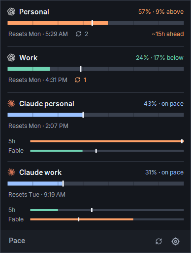
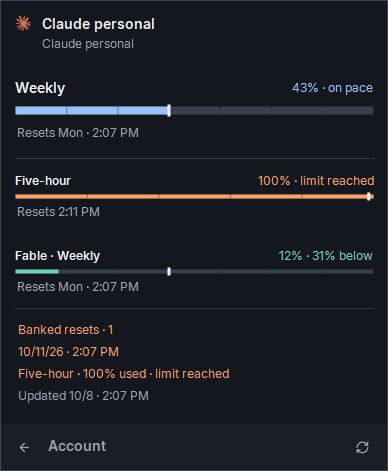
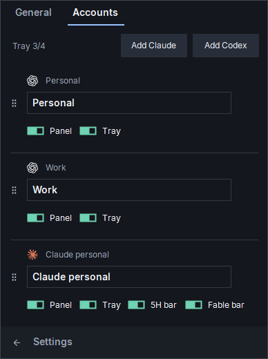
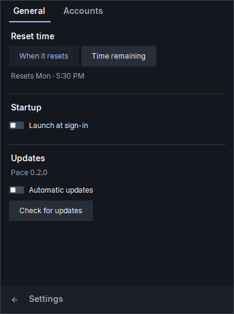

# Pace

A Windows tray app that shows Claude and Codex subscription usage relative to each
account's weekly reset.

## Download

[Download for Windows](https://github.com/mweint/Pace/releases/latest/download/Pace-win-x64.zip)

1. Extract the ZIP.
2. Open `Pace.exe` in the extracted `Pace` folder.
3. Click the tray icon to view usage or manage accounts.

Windows 10/11, x64. The .NET runtime is included. Keep the extracted files together.
Existing CLI sign-ins are detected automatically. Adding accounts requires the
corresponding Claude or Codex CLI; sign-in opens in your browser.

## Screenshots

Weekly overview, using sample accounts:



<details>
<summary>Account details, account management and tray hover</summary>

Account details:



Manage accounts:



Settings:



Tray hover:


</details>

## Reading the display

Pace compares usage with the portion of the week elapsed since each account's reset.
The tray icon shows up to four accounts:

- Orange: more than 2 percentage points above pace.
- Mint: more than 4 percentage points below pace.
- Blue: within the -4 to +2 point range, inclusive.
- Gray: usage is unavailable or stale.

`+9% · 15h` means 9 percentage points above pace, or about 15 hours until the
baseline catches up if usage stops. This is not a forecast. Provider rounding
limits the precision of these numbers.

Click an account for its available weekly, session and model-specific limits.
Reset labels show local clock time, adding the weekday for another day; hover
the account for the countdown. Banked resets appear beside the reset time;
hover the badge for expiry dates.
Orange indicates an expiry within seven days. Pace does not redeem resets.

Account names, visibility and order save automatically. Removing an account stops
monitoring it and keeps its sign-in files. Click away to dismiss the panel;
right-click the tray icon to quit. Usage refreshes every five minutes and pace
every minute.

Claude account options include **5H bar** and **Fable bar** for the overview
bars. Account details always show all available limits. An orange dot after an
account name means a hidden limit is at least 90% used. Click the account for
details. The dot clears when the bar is shown, usage falls below 90%, or the
limit resets. It cannot be dismissed. Details and the tray icon have no dots.

## Local data

Settings and managed sign-ins are stored in `%APPDATA%/Pace`. Data from the previous
app name migrates automatically. Windows can launch Pace at sign-in through a
current-user startup entry pointing to the installed executable.

## Settings

The overview gear opens Settings, with General and Accounts tabs. General lets
you choose reset clock times or time remaining, and enable or disable Windows
sign-in startup. Accounts retains naming, ordering, sign-in and visibility controls.
Tabs share a stable window size and footer, with room for three accounts;
longer lists use a slim themed scrollbar when needed. The
tray count and add-account actions live inside Accounts.

Updates are checked at launch and every six hours against this repository's
latest stable GitHub release. Check for updates runs a check immediately.
An orange dot on Settings indicates an available update; Dismiss clears it for
that version without removing the Update action. Automatic updates default off.
When enabled, Pace downloads a verified Windows package and installs it on the
next launch. Update installs immediately and restarts Pace. Packages must match
the release checksum and version. The installer backs up replaced files and
restores them if copying fails; settings and sign-ins remain outside the app.

Existing CLI sign-ins respect `CODEX_HOME` and `CLAUDE_CONFIG_DIR`. Tokens are read
from local credential files and sent to the corresponding service. Official CLIs
manage sign-in and renewal. Pace has no telemetry. Subscription endpoints are
undocumented and may change.

<details>
<summary>Development</summary>

Requires the .NET 8 SDK. See [STYLEGUIDE.txt](STYLEGUIDE.txt) and [AGENTS.md](AGENTS.md)
for theme ownership and contribution rules.

```powershell
dotnet build -c Release
dotnet publish -c Release -r win-x64 --self-contained true -o dist/Pace
.\bin\Release\net8.0-windows\Pace.exe --self-test self-test.json
.\bin\Release\net8.0-windows\Pace.exe --render-preview preview.png
```

Offline checks require an interactive Windows desktop with Explorer. Preview mode
uses sample accounts. `--live-check live-check.json` makes authenticated requests;
its report stays local.

Before publishing, stage source and required assets, then run
`pwsh -File scripts/Verify-Repository.ps1`. Credentials, settings, environment files,
local reports and builds are excluded from Git.

</details>

## Assets

- [Lucide icons](https://github.com/lucide-icons/lucide/tree/main/icons): SVGs,
  PNGs and ISC/Feather MIT notices in `Assets/Icons`.
- [Inter 4.1](https://github.com/rsms/inter/releases/tag/v4.1), by Rasmus Andersson:
  Pace Sans is a renamed derivative with a centered tilde. The SIL Open Font
  License and modification notice are in `Assets/Fonts`.

Service icons are terminal-prompt and sunburst drawings.
